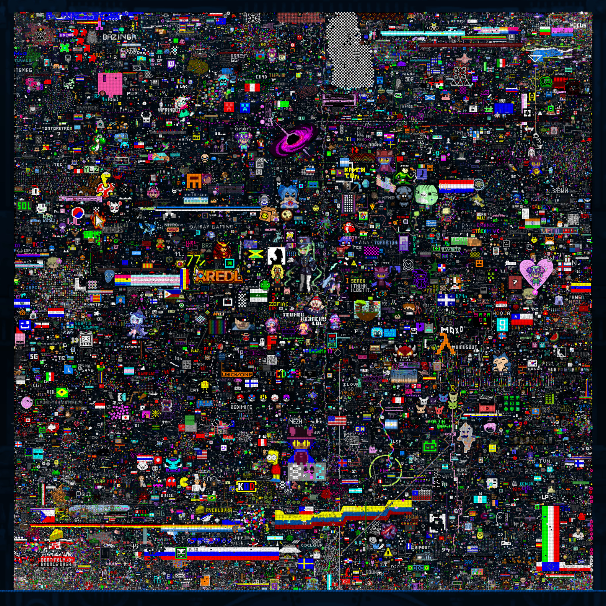

  

  

    <a href="https://ko-fi.com/placegd">
      <b>-<>-<>- This took a lot of hard work. Consider supporting us on <u>Ko-fi</u>! &lt;3 -<>-<>-</b>
    </a>
  

# GD Place 2024

On the 15th of November 2024, this website was used to allow over 45,000 people to collaborate on a single Geometry Dash platformer level. The main event lasted 50 hours, with a short period at the end where users could collaborate on the name of the level. 
The final level name, as decided by the community, was: **PlaTef01ngf234j egh1** 
The ID of the final level is: **112238667**

The countdown, before the start of the event, consisted of digits that were kindly created by many different people from within the Geometry Dash community. See the [credits](#credits) for everyone who was involved.

A video showcasing the event was created by Spu7Nix, and can be watched [here](https://www.youtube.com/watch?v=Vb71bat1utg).

<table>
  <tbody>
    <tr>
      <td>
        
      </td>
    </tr>
    <tr>
      <td>
        

          <b>Screenshot of the finished level.</b>
        

      </td>
    </tr>
  </tbody>
</table>

## About

GD Place is a massive [r/place](https://en.wikipedia.org/wiki/R/place)-style collaborative [Geometry Dash](https://en.wikipedia.org/wiki/Geometry_Dash) level-editor. The front end was created using Svelte, relying on WGPU to render the level, while the back end (authentication and server) was handled by Firebase. 
The history of the entire event, which includes all objects placed and deleted, and by who, was saved, and can be found [here](https://github.com/PlaceGD/gd-place-2024-data).

## Credits

The event was created and programmed by [@Spu7Nix](https://github.com/Spu7Nix), [@FlowVix](https://github.com/FlowVix) and [@DexterHill0](https://github.com/DexterHill0).

The digits in the countdown were created by: RobTopGames, Spu7Nix, Viprin, Cometface, Flow, G4lvatron, Fungifity, Thomartin, DreamingInsanity, Echonox, TamaN, SrGuillester, Bianox, SirHadoken, Jenkins, KINGTONY, Dominus, JonathanGD, Exyl, Jeyzor, Vermillion, MelX0exe, EricVanWilderman, Serponge, bli, Grax, KrmaL, DavJT, AudieoVisual, Doggie, Pocke, Subwoofer, para, WerewolfGD, Kips, Motleyorc, Nasgubb, Tchotchke, YunHaSeu, Rafer, ILRELL, Culuc, BoldStep, Evasium, Dorami, npesta, Partition, vrymer, meeloz, Glittershroom, xloco, Technical, connot, Rustam, DesTicY, xenoteric, logiking, AeonAir, Breadking, Neigefeu, Juniper, Wulzy, Platnuu, RadiationV2, Smiffy777, Knots, Terron, Aquatias, Thedevon, Digitalight, chunlv1, Stormfly, verticallity, Goose, Voxicat, Knobbelboy, ImMaxX1, DangerKat, Perox8, Zoink, and Sakura.

The colons in the countdown were created by: [@GDColon](https://github.com/GDColon).

**Thank you to everyone that participated in the event, and a big thank you to everyone that has supported us through Ko-fi!**

## Wallpaper Engine

If you came here looking for the wallpaper engine code, see the [wp-engine branch](https://github.com/PlaceGD/gd-place-2024/tree/wp-engine).
